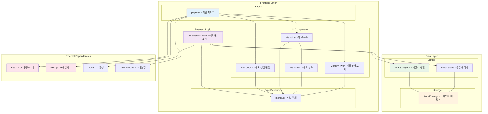

# 메모 앱 시스템 아키텍처

## 개요

메모 앱은 Next.js 기반의 클라이언트 사이드 애플리케이션으로, React 컴포넌트 아키텍처와 LocalStorage를 활용한 데이터 관리 시스템을 구현합니다.

## 시스템 아키텍처 다이어그램

## 아키텍처 설명

### Frontend Layer

**Pages**
- `page.tsx`: 애플리케이션의 메인 페이지로, 전체 UI 레이아웃과 상태 관리를 담당합니다.

**UI Components**
- `MemoForm`: 새 메모 생성 및 기존 메모 편집을 위한 모달 폼
- `MemoList`: 메모 목록 표시, 검색 및 필터링 기능 제공
- `MemoItem`: 개별 메모 항목 표시 및 기본 액션 제공
- `MemoViewer`: 메모 상세 내용 보기 및 편집/삭제 액션 제공

**Business Logic**
- `useMemos`: 메모 CRUD 작업, 검색, 필터링, 상태 관리를 담당하는 커스텀 훅

**Type Definitions**
- `memo.ts`: Memo 관련 타입, 인터페이스, 상수 정의

### Data Layer

**Utilities**
- `localStorage.ts`: LocalStorage와의 모든 상호작용을 캡슐화한 유틸리티
- `seedData.ts`: 초기 샘플 데이터 생성 및 시딩 로직

**Storage**
- `LocalStorage`: 브라우저의 로컬 저장소를 통한 데이터 영속성

### 데이터 플로우

1. **생성**: useMemos → localStorage.ts → LocalStorage
2. **조회**: LocalStorage → localStorage.ts → useMemos → Components
3. **수정**: Components → useMemos → localStorage.ts → LocalStorage
4. **삭제**: Components → useMemos → localStorage.ts → LocalStorage

### 주요 특징

- **클라이언트 사이드 아키텍처**: 모든 데이터 처리가 브라우저에서 이루어짐
- **컴포넌트 기반 구조**: 재사용 가능한 React 컴포넌트들로 구성
- **훅 기반 상태 관리**: useMemos를 통한 중앙화된 비즈니스 로직
- **LocalStorage 영속성**: 별도 백엔드 없이 브라우저 저장소 활용
- **타입 안전성**: TypeScript를 통한 정적 타입 검사

## 장점

- **간단한 배포**: 정적 파일로 배포 가능
- **빠른 응답**: 클라이언트 사이드 처리로 즉시 반응
- **오프라인 지원**: 네트워크 연결 없이도 동작
- **타입 안전성**: TypeScript를 통한 개발 시 오류 방지

## 고려사항

- **데이터 제한**: LocalStorage 용량 제한 (일반적으로 5-10MB)
- **브라우저 의존성**: 브라우저별 LocalStorage 지원 차이
- **데이터 공유 불가**: 디바이스 간 데이터 동기화 불가능
- **데이터 손실 위험**: 브라우저 캐시 삭제 시 데이터 손실 가능성